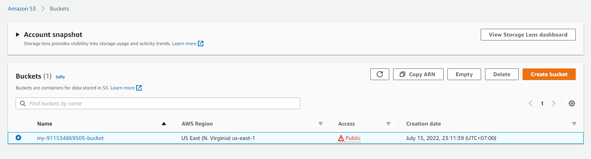
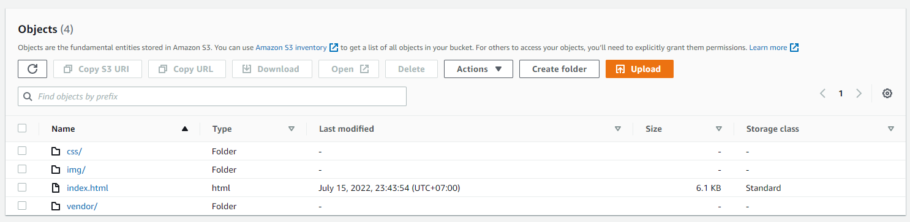
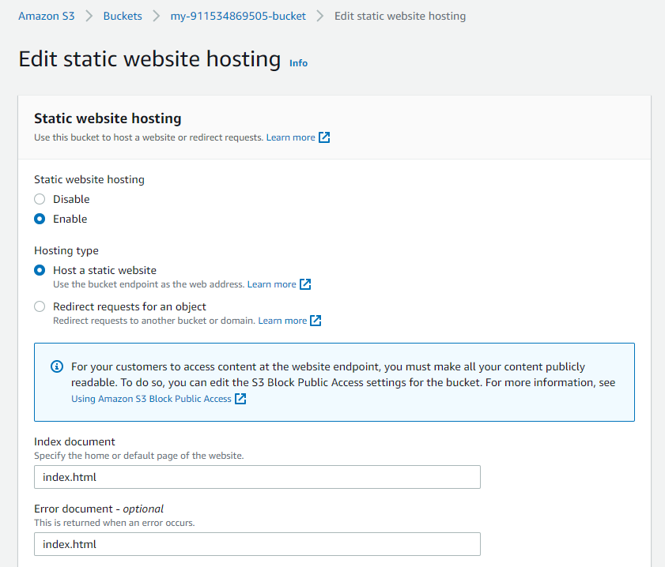
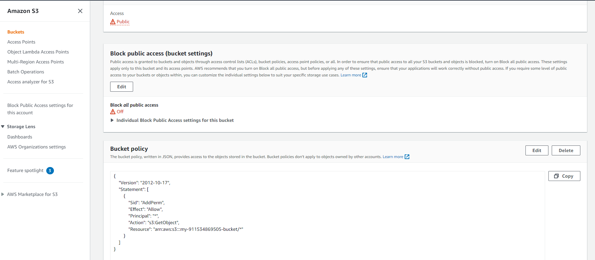
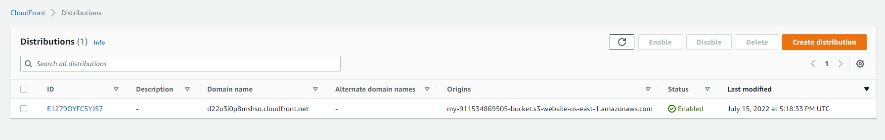

# Deploy Static Website on AWS

## Website Files

### The student has created a S3 bucket.

### All website files should be added to the S3 bucket.

### The bucket configuration should be set up to support static website hosting.

### The permission access to the bucket should be configured.

## Website Distribution

### The website should be distributed via Cloudfront.

## Web Browser Access

### Is the website publicly accessible?
- CloudFront domain name

- Website URL

- S3 object URL 
